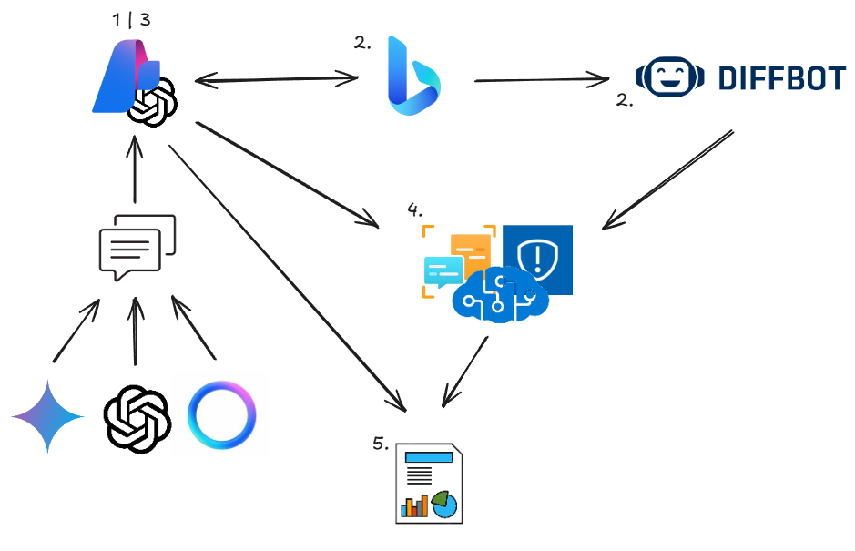
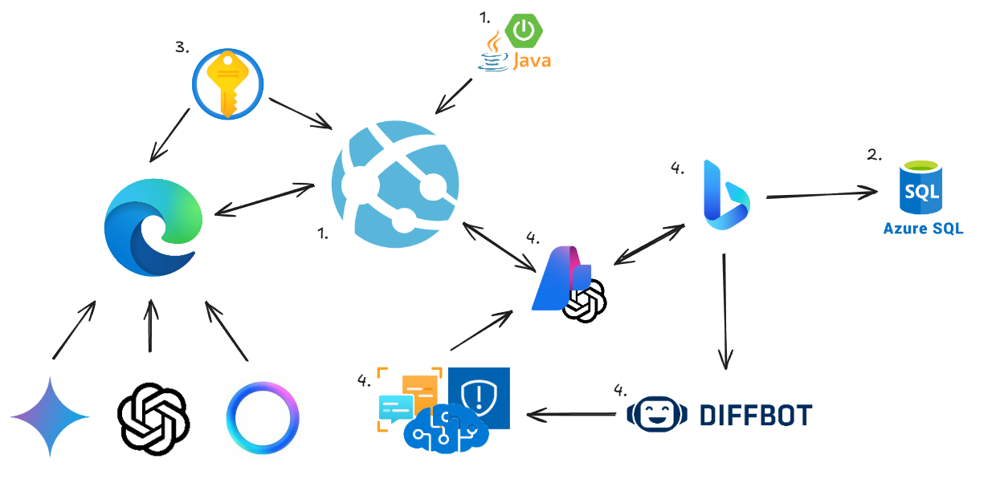

---

Due to connection issues and technical difficulties, it was not possible to upload the video directly to Hackbox. Therefore, we have included the link to the video directly in the repository for access:

[The video is available at this link](https://youtu.be/n4xvq8gw8cg?si=5CvkwVe-5XzHRIgU)

---

# 🌸 *LotusVerify*: Your Shield Against Misinformation 🌸

In a world full of information, *how can you distinguish truth from fiction?*  
*LotusVerify* is the answer. Designed for academics, researchers, and knowledge seekers, this browser extension verifies content generated by AI systems like ChatGPT, Gemini, and LLaMa, ensuring that what you read is backed by real facts.  

Inspired by the Lotus Flower, which remains pure in murky waters, we created LotusVerify to be *your trusted guide in the ocean of digital data*.  

---

## 🚀 *Why LotusVerify?*  

- *Trust:* Every phrase is analyzed and cross-checked with verified online sources.  
- *Accuracy:* We use cutting-edge technologies to process and compare information.  
- *Speed:* Within seconds, you'll get a confidence percentage backed by rigorous analysis.  

Whether it's for academic projects, scientific research, or casual inquiries, *LotusVerify* helps you separate fact from fiction.  

---

## 🧠 *How Does It Work?*

1. *📜 Initial Text Analysis*  
   AI-generated content is split into key phrases to maintain context.  

2. *🔍 Intelligent Search*  
   - *Bing Search API* locates reliable sources based on the key phrases.  
   - Relevant content is extracted using *Diffbot*.  

3. *🤖 Validation with GPT-4o*  
   - Classifies phrases as:  
     - *Correct:* Matches the phrase exactly.  
     - *Precise:* Does not match entirely but is contextually relevant.  
     - *Irrelevant:* Lacks relevance.  

4. *🔑 Detailed Processing with Text Analytics*  
   - Breaks down texts into words and key phrases.  
   - Compares original texts with external sources to calculate matches.  

5. *📊 Clear and Reliable Results*  
   - We analyze true positives, negatives, and false data to generate a confidence percentage.  
   - Reliable data is stored for future searches.  

---

## 🛠 *Our Infrastructure*

### *1. Robust Backend*  
- Developed in *Java with Spring Boot* and deployed on *Azure App Service* to ensure high availability and speed.  

### *2. Azure Database*  
- Stores validated searches with high reliability, building a database of trustworthy sources.  

### *3. Security with Azure Key Vault*  
- Protects our credentials and secrets, ensuring data privacy.  

### *4. Key APIs and Services*  
- *Diffbot:* Extracts full text from relevant web pages.  
- *Azure Text Analytics:* Breaks down and compares key phrases and words.  
- *Bing Search API:* Main search engine for locating reliable sources.  
- *Content Safety:* Filters inappropriate or malicious content.  
- *GPT-4o:* Splits text into phrases and statements while maintaining context. It compares search results with the extracted phrases.  

---

## 💡 *What Makes LotusVerify Unique?*  

- *🌐 Reliable Validations:* We don’t just search; we validate using state-of-the-art technology.  
- *📖 Academic Precision:* Perfect for scientific, technological, historical, and social topics.  
- *🛡 Protecting Your Searches:* Sensitive data and validated results remain secure within our infrastructure.  

---

## 🖥 *Installation*
IMPORTANT: Currently available for Edge and Chrome, compatible exclusively with GPT and Gemini models. Responses are limited to 40 words due to Azure subscription constraints.

- Download the folder [chatgpt-plugin](https://github.com/Gi0yis/lotus-verify/tree/main/edge-extension/chatgpt-plugin).  
- Go to: [edge://extensions/ or chrome://extensions/](edge://extensions/).
- Enable "Developer Mode."  
- Click "Load unpacked" and select the project folder.  

---

## 🌍 A Global Project

LotusVerify is not just a tool; it's a movement to create a more trustworthy internet. With every search you validate, you contribute to building a database of verified and accessible knowledge for everyone.  

---

Verify. Confirm. Trust! 🌸
