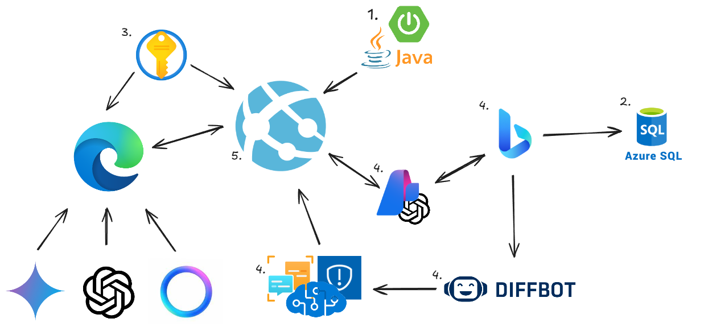

# 🌸 *LotusVerify*: Tu Escudo Contra la Desinformación 🌸

En un mundo lleno de información, *¿cómo saber qué es verdad y qué no lo es?*  
*LotusVerify* es la respuesta. Diseñada para académicos, investigadores y curiosos del conocimiento, esta extensión de navegador verifica el contenido generado por inteligencias artificiales como ChatGPT, Gemini y LLaMa, asegurando que lo que lees tenga respaldo en hechos reales.  

Inspirados por la Flor de Loto, que permanece impecable en aguas turbias, creamos LotusVerify para ser *tu guía confiable en el océano de datos digitales*.  

---

## 🚀 *¿Por qué LotusVerify?*  

- *Confianza:* Cada frase es analizada y contrastada con fuentes verificadas en internet.  
- *Precisión:* Utilizamos tecnologías de punta para procesar y comparar información.  
- *Velocidad:* En segundos, obtendrás un porcentaje de confianza respaldado por análisis rigurosos.  

Ya sea para proyectos académicos, investigaciones científicas o simples consultas, *LotusVerify* te ayuda a separar hechos de ficción.  

---

## 🧠 *¿Cómo Funciona?*

1. *📜 Análisis Inicial del Texto*  
   El contenido generado por la IA se divide en frases clave para mantener el contexto.  

2. *🔍 Búsqueda Inteligente*  
   - *Bing Search API* localiza fuentes confiables basándose en las frases clave.  
   - El contenido relevante se extrae con *Diffbot*.  

3. *🤖 Validación con GPT-4o*  
   - Clasifica las frases como:  
     - *Correcto:* Coinciden con la búsqueda.  
     - *Preciso:*.  
     - *Irrelevante:* No guardan relación.  

4. *🔑 Procesamiento Detallado con Text Analytics*  
   - Desglosa los textos en palabras y frases clave.  
   - Compara los textos originales y las fuentes externas para calcular coincidencias.  

5. *📊 Resultados Claros y Confiables*  
   - Analizamos verdaderos positivos, negativos y falsos para generar un porcentaje de confianza.  
   - Los datos confiables se almacenan para futuras búsquedas.  

---

## 🛠 *Nuestra Infraestructura*

### *1. Backend Potente*  
- Desarrollado en *Java con Spring Boot* y desplegado en *Azure App Service*, garantiza alta disponibilidad y velocidad.  

### *2. Azure Database*  
- Almacenamos búsquedas validadas con alta confiabilidad, construyendo una base de datos de fuentes confiables.  

### *3. Seguridad con Azure Key Vault*  
- Protege nuestras credenciales y secretos para mantener la privacidad de los datos.  

### *4. APIs y Servicios Clave*  
- *Diffbot:* Extrae el texto completo de las páginas web relevantes.  
- *Azure Text Analytics:* Desglosa y compara palabras y frases clave.  
- *Bing Search API:* Motor de búsqueda principal para localizar fuentes confiables.  
- *Content Safety:* Filtra contenido inapropiado o malicioso.  

---

## 💡 *¿Qué Hace Único a LotusVerify?*  

- *🌐 Inteligencia Confiable:* No solo hacemos búsquedas, las validamos con tecnología de última generación.  
- *📖 Precisión Académica:* Ideal para temas científicos, tecnológicos, históricos y sociales.  
- *🛡 Protegemos tus Búsquedas:* Datos sensibles y resultados validados permanecen seguros en nuestra infraestructura.  

---

## 🖥 *Instalación*

---

## 🌍 Un Proyecto Global

LotusVerify no es solo una herramienta, es un movimiento para crear un internet más confiable. Con cada búsqueda que validas, contribuyes a construir una base de datos de conocimiento verificado y accesible para todos.

---

¡Únete a nuestra misión de limpiar las aguas de la información! 🌸